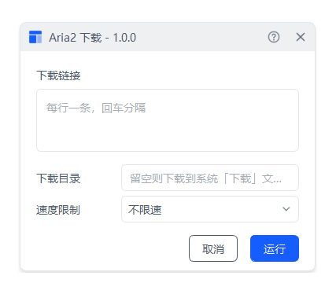

# Aria2 下载

> 轻量 Aria2 图形化窗口脚本，无需复杂配置，粘贴链接一键开始下载

---

## 核心特性

- **图形化窗口下载**：填写链接、选目录、限速，点「执行」即开始下载，不用碰命令行
- **多种下载协议**：支持 HTTP / HTTPS / FTP 直链与 magnet 磁力链
- **多行批量下载**：一行一条链接，可同时下载多条，自动并行
- **速度限制**：一键限速（不限速 / 500KB/s / 1MB/s / 5MB/s / 10MB/s）
- **默认下载到「下载」文件夹**：不填目录即自动落到系统下载文件夹，换电脑也成立
- **轻量实现** Powershell脚本、仅依赖aria2(不忙脚本盒子会自动下载)、无多余臃肿依赖
- **定时任务**：可配置为定时自动下载，无人值守
- **脚本联动（节点）**：可被其他脚本调用，返回下载目录与链接条数

---

## 脚本演示

---

## 安装方法

本脚本的运行环境、aria2 引擎及图形化窗口均依赖「不忙脚本盒子」，建议仅通过盒子安装和使用本脚本。

> 前置条件：安装好 [不忙脚本盒子](https://www.bm-box.cn)

* 打开盒子 → **脚本市场** → 搜索 **「Aria2 下载」**
* 点击「安装」

---

## 使用方式

* **直接启动**
  
  1. 点击脚本卡片
  2. 在弹出的图形窗口的「下载链接」框中粘贴链接，一行一条，可多条
  3. 可选：设置「下载目录」（留空 = 系统「下载」文件夹）、「速度限制」
  4. 点「执行」开始下载，命令行窗口实时显示速度，下载完成自动退出

* **右键启动**
  
  * 在文件管理器的空白处点击鼠标右键 → 菜单中找到 **「Aria2 下载」**
  * 直接弹出下载窗口，粘贴链接即可下载

* **快捷键启动**
  
  * 为脚本设置全局快捷键（盒子 → 快捷键设置）
  * 按下快捷键即弹出下载窗口，无需选中任何文件

* **定时任务**
  
  1. 在盒子的定时任务中新建任务，选择本脚本
  2. 在表单里填好链接、目录、限速
  3. 设定执行时间，到点自动下载，无需守在电脑前

---

## 💡 使用提示

- 磁力链（magnet:?xt=…）直接粘贴即可，无需先转换种子
- 下载中断后再次运行同一条链接，会**断点续传**（`.aria2` 控制文件在下载目录里）
- 中文文件名的链接默认按 UTF-8 解析，避免乱码

---

## 节点脚本(开发者阅读)

本脚本声明为节点，可被其他盒子脚本通过 `/api/link` 调用。调用时同步等待下载完成，返回信封中的业务键：

| 业务键            | 类型  | 说明           |
| -------------- | --- | ------------ |
| `download_dir` | str | 下载目录（文件保存位置） |
| `links_count`  | str | 本次下载的链接条数    |

信封格式：`{ "code": 0, "msg": "ok", "download_dir": "…", "links_count": "2" }`

---

## 🖥️ 环境要求

| 项目       | 要求                             |
| -------- | ------------------------------ |
| **操作系统** | Windows 10+（64 位）              |
| **运行环境** | 不忙脚本盒子 + aria2（安装脚本时自动下载）      |
| **网络**   | 首次安装需联网下载 aria2 引擎；下载时需可访问目标资源 |
